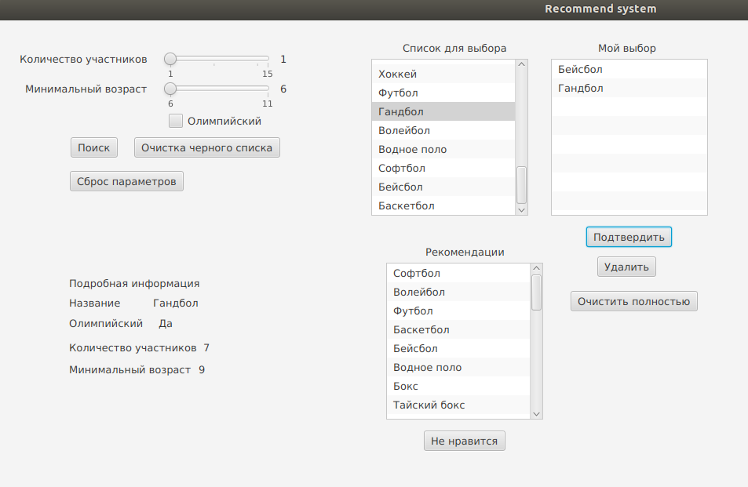

# Рекомендательная система видов спорта
## Интерфейс
Интерфейс приложения выполнен с помощью JavaFx.

Пользователю представлены 3 списка:
- список с видами спорта для выбора
- список выбранных пользователем видов спорта 
- список рекомендованных приложением видов спорта

Имеется производить поиск по параметрам:
- Количество участников
- Минимальный возраст
- Олимпийский (Да/Нет)

Также имеется сброс параметров, при этом пользователю будут представлены все виды спорта.

После подтверждения выбора пользователем видов спорта, которые были выбраны, пользователю показываются рекомендации выданные приложением.

Пользователю предоставляется возможность добавить в "черный список" виды спорта из списка рекомендаций, а также очистка "черного списка".

## Функции
- поиск по параметрам
- выдача рекомендаций
- отмена рекомендации (кнопка 'не нравится')
- подробная информация по конкретному спорту

### Поиск по параметрам
Если существует виды спорта полностью соответствующие заданным пользователем параметрам, то выдаем его пользователю.

Иначе ищем в диапазоне, сначала +-1 от заданного значения, затем инкрементируем offset до тех пор, пока не найдем совпадение.
Таким образом, обеспечивается выдача пользователю непустого списка видов спорта.

На приведенном скриншоте не нашлось спорта, который подходит точно под заданные параметры, но нашлось очень похожий по параметрам. 

### Выдача рекомендаций
Для предоставления рекомендаций используется гибридная рекомендательная система.

Используются 2 стратегии:
- Коллаборативная фильтрация
- Контент-ориентированная

По-умолчанию используется коллаборативная фильтрация, если эта стратегия ничего не рекомендует, то используется контент-ориентированная стратегия выдачи рекомендаций. Автор системы предпочел данную стратегию по-умолчанию, т.к. считает что использование статистики прошлых выбранных вместе видов спорта целесообразна.

Для коллаборативной фильтрации 3 шаблона/группы видов спорта (заранее заданные), для ранжирования выдачи используется евклидово расстояние.

Для контент-ориентированной фильтрации используется мера близости: евклидово расстояние, так как автор системы предпочел выдавать рекомендации, основываясь на атрибуты спортов. Пользователю выдаётся список из топ 15 видов спорта, ранжированный по используемой мерой близости.

На приведенном выше рисунке, система не нашла рекомендаций, используя коллаборативную фильтрацию, поэтому она воспользовалась контентно-ориентированной стратегией, и выдала результат.

Так как мера близости использовалась евклидова (основываясь на сходстве параметров), то действительно, топ-6 рекомендованных видов спорта очень похожи, кол-во участников находится вблизи 7 человек, минимальный возраст аналогично не сильно отличается.
### Отмена рекомендации (кнопка 'не нравится')
Для реализации данной функции используется идея "черного списка". При подтверждении того, что конкретный вид спорта не нравится пользователю, этот вид спорта заносится в "черный список" и в последующих выдачах рекомендаций он игнорируется.
